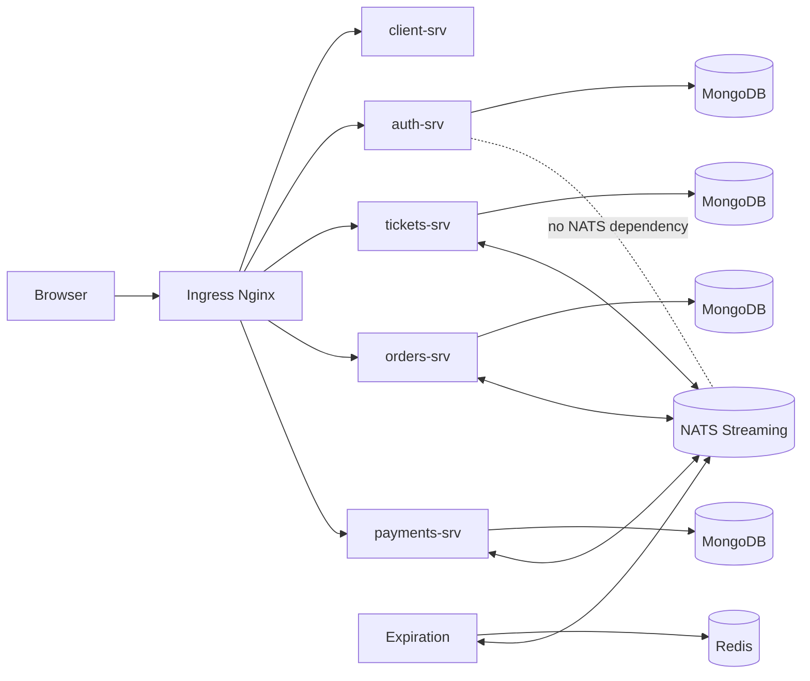
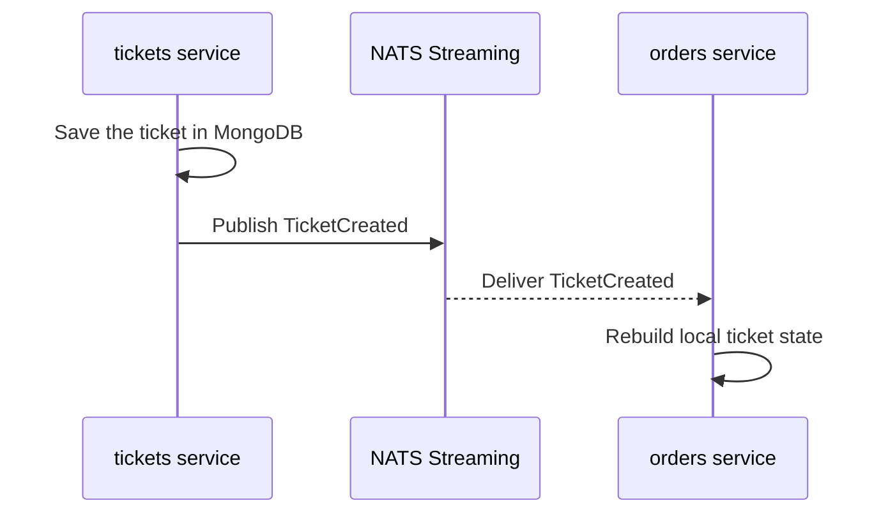
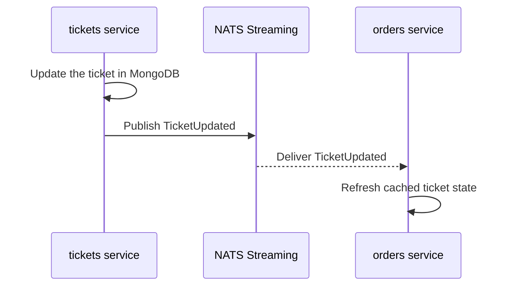
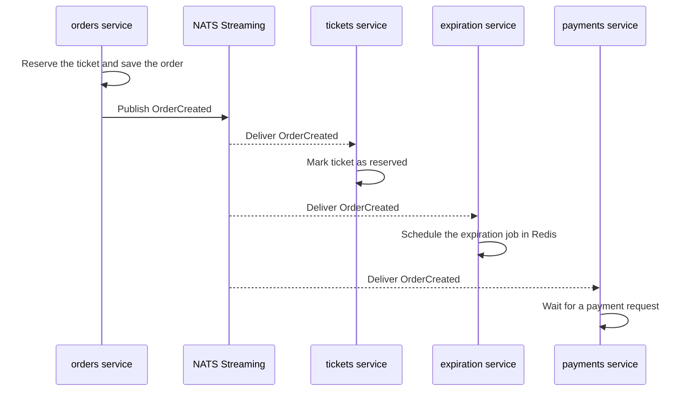
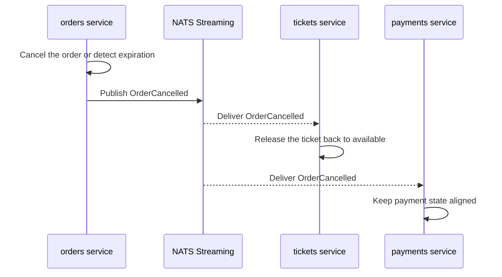
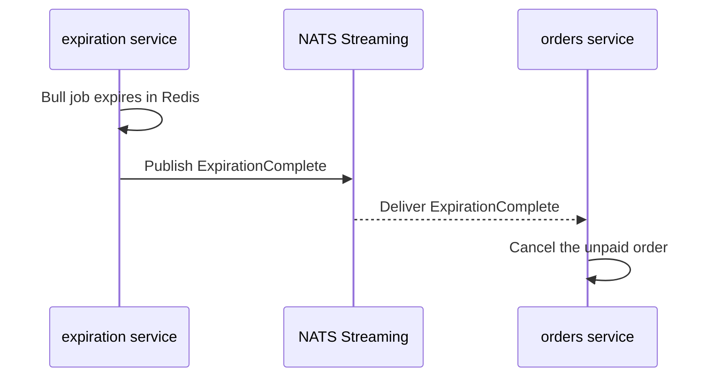
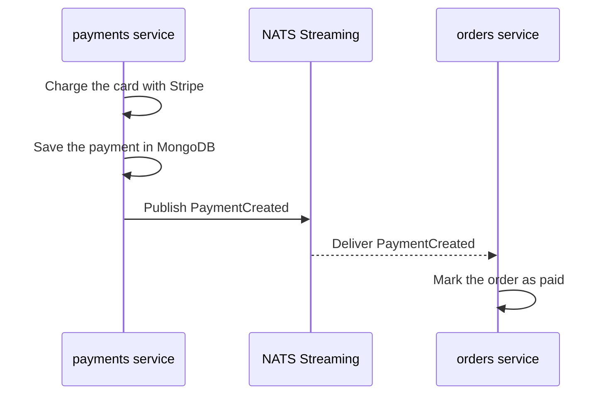
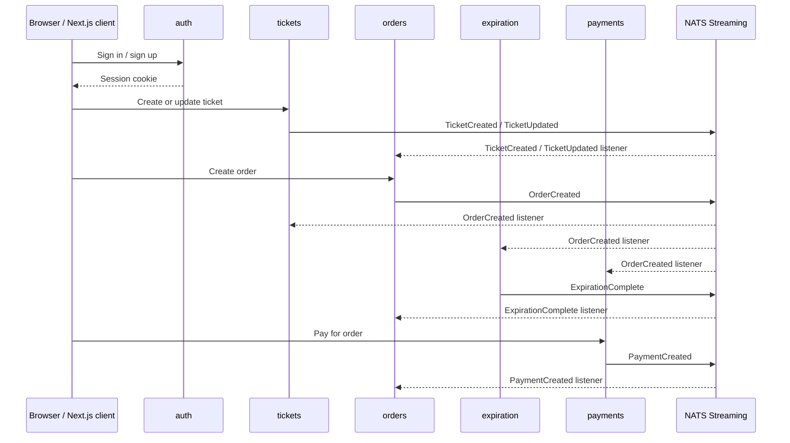

# Ticketing App Architecture

This repository is a microservices-based ticket marketplace built around an event-driven architecture.

The system is split into five application services plus shared infrastructure:

- `auth` handles sign-up, sign-in, sign-out, and current-user session state.
- `tickets` lets users create, update, and browse ticket listings.
- `orders` creates and manages orders for tickets.
- `payments` charges a card when an order is ready to be paid.
- `expiration` cancels unpaid orders after their payment window expires.
- `client` is the Next.js frontend.
- `common` contains shared types, middleware, event definitions, and error classes.

The application uses:

- MongoDB for durable service-owned data.
- NATS Streaming for service-to-service events.
- Redis and Bull for delayed expiration jobs.
- Stripe for payments.
- Kubernetes for runtime orchestration.
- Skaffold for local build-and-deploy workflow.

## High-Level Architecture



The browser never talks directly to the internal pods. It talks to the ingress controller, which routes requests to the correct service based on the path prefix.

## Request Routing

The ingress rules in `infra/k8s/ingress-srv.yaml` expose the application through the `ticket.com` host:

- `/api/users/*` -> `auth-srv`
- `/api/tickets/*` -> `tickets-srv`
- `/api/orders/*` -> `orders-srv`
- `/api/payments/*` -> `payments-srv`
- everything else -> `client-srv`

That means the frontend and the API share the same public hostname, which keeps cookie-based auth simple and avoids cross-origin issues.

The Next.js client also uses two different request paths depending on where the code is running:

- Server-side rendering forwards the incoming request headers to the in-cluster ingress controller service.
- Browser-side requests go to relative URLs like `/api/users/currentUser`.

## Service Responsibilities

### `auth`

Auth is the session boundary for the application. It stores users in MongoDB, signs JWTs, and places the JWT into a cookie session.

Exposed routes:

- `POST /api/users/signup`
- `POST /api/users/signin`
- `POST /api/users/signout`
- `GET /api/users/currentUser`

The service does not publish or subscribe to NATS events. It is responsible for identity and session state only.

### `tickets`

Tickets manages inventory that can be purchased. A ticket is the unit of sale in the system.

Exposed routes:

- `POST /api/tickets`
- `GET /api/tickets`
- `GET /api/tickets/:ticketId`
- `PATCH /api/tickets/:ticketId`

Tickets publishes ticket lifecycle events to NATS:

- `Subjects.TicketCreated`
- `Subjects.TicketUpdated`

Tickets also listens for order lifecycle events so it can prevent edits while a ticket is reserved:

- `Subjects.OrderCreated`
- `Subjects.OrderCancelled`

### `orders`

Orders owns the reservation and purchase intent lifecycle.

Exposed routes:

- `POST /api/orders`
- `GET /api/orders`
- `GET /api/orders/:orderId`
- `DELETE /api/orders/:orderId`

Orders listens to:

- `Subjects.TicketCreated`
- `Subjects.TicketUpdated`
- `Subjects.ExpirationComplete`
- `Subjects.PaymentCreated`

Orders publishes:

- `Subjects.OrderCreated`
- `Subjects.OrderCancelled`

The orders service is the main coordination point between ticket availability, expiration, and payment completion.

### `payments`

Payments charges a user once an order is ready to be paid.

Exposed route:

- `POST /api/payments`

Payments listens to order events:

- `Subjects.OrderCreated`
- `Subjects.OrderCancelled`

Payments publishes:

- `Subjects.PaymentCreated`

It uses Stripe for the actual charge and records the resulting payment in MongoDB.

### `expiration`

Expiration is a background worker service.

It listens for:

- `Subjects.OrderCreated`

It publishes:

- `Subjects.ExpirationComplete`

When an order is created, expiration schedules a delayed job in Redis through Bull. When the job fires, the service publishes the expiration event so orders can cancel the unpaid order.

### `client`

The client is a Next.js application.

It renders the UI, fetches the current user during page initialization, and forwards requests through the ingress controller.

It does not require a custom application environment file in this repository. The runtime routing comes from the shared hostname and ingress configuration.

### `common`

`common` is the shared package that keeps the services aligned.

It contains:

- shared error classes
- auth middleware
- event base classes
- event type definitions
- request validation helpers

This package is published as `@ahabtickets/common` and each service consumes the compiled build output.

## NATS Streaming Design

The event bus is NATS Streaming, not plain request/response HTTP.

The NATS deployment is defined in `infra/k8s/nats-depl.yaml` and uses:

- image: `nats-streaming:0.17.0`
- cluster ID: `ticketing`
- client port: `4222`
- monitoring port: `8222`

Every service that connects to NATS uses:

- `NATS_CLUSTER_ID=ticketing`
- `NATS_URL=http://nats-srv:4222`
- a unique `NATS_CLIENT_ID`

In Kubernetes, the client id is injected from `metadata.name`, so every pod gets a unique subscriber identity. That prevents collisions when the same deployment scales or restarts.

### Why this matters

NATS turns the services into independent workers that react to events instead of tightly coupling them with synchronous calls.

That gives you:

- lower coupling between services
- easier horizontal scaling
- better fault isolation
- a clear event history for business actions

### Event Map

This is the core event graph in the system.

| Event | Publisher | Subscribers | Purpose |
| --- | --- | --- | --- |
| `TicketCreated` | `tickets` | `orders` | Make new ticket data visible to the order service |
| `TicketUpdated` | `tickets` | `orders` | Keep the order service synchronized with ticket changes |
| `OrderCreated` | `orders` | `tickets`, `expiration`, `payments` | Reserve the ticket, start the expiration timer, and prepare for payment |
| `OrderCancelled` | `orders` | `tickets`, `payments` | Release a ticket reservation and keep payment state aligned |
| `ExpirationComplete` | `expiration` | `orders` | Cancel unpaid orders when the payment window ends |
| `PaymentCreated` | `payments` | `orders` | Mark an order as paid after Stripe succeeds |

The diagrams below show the event bus as the middle layer. The publishing service sends the event to NATS, and each listening service receives the same event from NATS.

#### TicketCreated



`tickets` publishes `TicketCreated` when a new ticket is saved. `orders` listens so it can build its own local copy of the ticket data.

#### TicketUpdated



`tickets` publishes `TicketUpdated` when the ticket title, price, or availability changes. `orders` listens so it never works from stale ticket information.

#### OrderCreated



`orders` publishes `OrderCreated` after a ticket is reserved. `tickets` listens to mark the ticket as reserved, `expiration` listens to start the countdown, and `payments` listens so it can react to the order lifecycle.

#### OrderCancelled



`orders` publishes `OrderCancelled` when the order is deleted or expires. `tickets` listens so the ticket becomes available again, and `payments` listens so it can stay aligned with the order state.

#### ExpirationComplete



`expiration` publishes `ExpirationComplete` when the Redis-delayed job fires. `orders` listens and cancels the order if it was never paid.

#### PaymentCreated



`payments` publishes `PaymentCreated` after Stripe successfully creates the charge. `orders` listens so it can finalize the paid order state.



If you only remember one thing, remember this: `tickets` creates ticket events, `orders` creates order events, `expiration` creates expiration events, and `payments` creates payment events. `orders` is the main service that listens to almost every other event because it coordinates the order lifecycle.

## Data Ownership

Each service owns its own data store.

- `auth` -> `mongodb://auth-mongo-srv:27017/auth`
- `tickets` -> `mongodb://tickets-mongo-srv:27017/tickets`
- `orders` -> `mongodb://orders-mongo-srv:27017/orders`
- `payments` -> `mongodb://payments-mongo-srv:27017/payments`
- `expiration` -> `expiration-redis-srv`

This is the standard microservices pattern: one service, one source of truth, one datastore.

### Important Ticket Versioning Note

Ticket models use `version` as the Mongoose version key.

That means event payloads and concurrency checks must use `ticket.version`, not `ticket.__v`.

This is important because event ordering is used to keep the services consistent. If a ticket update event arrives out of sequence, the listeners can detect the version gap and avoid applying stale data.

## Environment Variables

This section lists the runtime variables each service expects.

### `auth`

| Variable | Purpose |
| --- | --- |
| `MONGO_URI` | MongoDB connection string for the auth database |
| `JWT_KEY` | Secret used to sign and verify JWT cookies |

### `tickets`

| Variable | Purpose |
| --- | --- |
| `MONGO_URI` | MongoDB connection string for the tickets database |
| `JWT_KEY` | JWT secret used by auth middleware |
| `NATS_CLUSTER_ID` | NATS Streaming cluster name, set to `ticketing` |
| `NATS_URL` | NATS client URL, usually `http://nats-srv:4222` |
| `NATS_CLIENT_ID` | Unique NATS client identifier, usually the pod name |

### `orders`

| Variable | Purpose |
| --- | --- |
| `MONGO_URI` | MongoDB connection string for the orders database |
| `JWT_KEY` | JWT secret used by auth middleware |
| `NATS_CLUSTER_ID` | NATS Streaming cluster name, set to `ticketing` |
| `NATS_URL` | NATS client URL, usually `http://nats-srv:4222` |
| `NATS_CLIENT_ID` | Unique NATS client identifier, usually the pod name |

### `payments`

| Variable | Purpose |
| --- | --- |
| `MONGO_URI` | MongoDB connection string for the payments database |
| `JWT_KEY` | JWT secret used by auth middleware |
| `NATS_CLUSTER_ID` | NATS Streaming cluster name, set to `ticketing` |
| `NATS_URL` | NATS client URL, usually `http://nats-srv:4222` |
| `NATS_CLIENT_ID` | Unique NATS client identifier, usually the pod name |
| `STRIPE_KEY` | Stripe secret key used to create charges |

### `expiration`

| Variable | Purpose |
| --- | --- |
| `NATS_CLUSTER_ID` | NATS Streaming cluster name, set to `ticketing` |
| `NATS_URL` | NATS client URL, usually `http://nats-srv:4222` |
| `NATS_CLIENT_ID` | Unique NATS client identifier, usually the pod name |
| `REDIS_HOST` | Redis host name, usually `expiration-redis-srv` |

### `client`

The client does not currently require a dedicated `.env` file in this repository.

It relies on:

- the public ingress hostname `ticket.com`
- relative browser-side API calls
- server-side forwarding through the ingress controller service

## Local Development Options

There are three practical ways to run the app locally.

### Option 1: Recommended, Kubernetes plus Skaffold

This is the intended developer workflow for this repository.

What it does:

- builds every service image from the local Dockerfiles
- deploys the Kubernetes manifests from `infra/k8s`
- syncs file changes into running pods for fast iteration

#### Before you start

Make sure these are running or installed first:

- Docker Desktop with the Docker engine running
- Kubernetes enabled in Docker Desktop, or a Minikube cluster started separately
- `kubectl` configured against the cluster you want to use
- Skaffold installed and available on your `PATH`

On Windows, Docker Desktop is usually the simplest choice because Skaffold can talk to the same local Docker daemon that Kubernetes uses.

#### Prerequisites

- Docker Desktop or another Docker runtime
- `kubectl`
- a local Kubernetes cluster such as Minikube or Docker Desktop Kubernetes
- Skaffold
- the Nginx ingress controller installed in the cluster

#### Startup order

Use this order when you start the system from scratch:

1. Start Docker Desktop and wait for the engine to report healthy.
2. Make sure Kubernetes is enabled in Docker Desktop, or run `minikube start` if you are using Minikube.
3. Install the Nginx ingress controller if your cluster does not already have it.
4. Create the Kubernetes secrets required by the app.
5. Start the application with Skaffold.
6. Open the app through the ingress hostname.

#### One-time cluster setup

If you are using Minikube, start the cluster first.

```bash
minikube start
```

Install the Nginx ingress controller if it is not already available in your cluster.

```bash
kubectl apply -f https://raw.githubusercontent.com/kubernetes/ingress-nginx/main/deploy/static/provider/cloud/deploy.yaml
```

Wait for the ingress controller to become ready before continuing.

Add the application host to your local hosts file so the ingress rule can match `ticket.com`.

- `127.0.0.1 ticket.com`

If you are using Docker Desktop Kubernetes, the ingress controller still needs to be installed, but you do not need a separate Minikube cluster.

#### Create required secrets

Create the JWT secret.

```bash
kubectl create secret generic jwt-secret --from-literal=JWT_KEY=supersecretpassword
```

Create the Stripe secret.

```bash
kubectl create secret generic stripe-secret --from-literal=STRIPE_KEY=sk_test_your_stripe_secret
```

#### Run the stack

```bash
skaffold dev
```

Skaffold reads `skaffold.yaml`, builds these images from the service Dockerfiles, and deploys the manifests from `infra/k8s`:

- `ahmed0ahmed/orders`
- `ahmed0ahmed/auth`
- `ahmed0ahmed/client`
- `ahmed0ahmed/tickets`
- `ahmed0ahmed/expiration`
- `ahmed0ahmed/payments`

If your Docker Hub namespace is different, update the image prefixes in `skaffold.yaml` before you start.

If you want to watch the actual deployment flow, Skaffold is doing two jobs at once:

- it builds or reuses the service images locally
- it applies the Kubernetes manifests and keeps them updated as files change

#### Open the app

Once the pods are ready, open:

```bash
http://ticket.com
```

The ingress controller will route the request to the client service, and the client will call the API services through the same hostname.

#### Typical local run sequence

This is the most common practical startup flow:

```bash
kubectl create secret generic jwt-secret --from-literal=JWT_KEY=supersecretpassword
kubectl create secret generic stripe-secret --from-literal=STRIPE_KEY=sk_test_your_stripe_secret
skaffold dev
```

If the app uses `ticket.com`, make sure the host entry points to your local machine or cluster ingress IP.

### Option 2: Manual Docker image build

If you want to build the service images yourself without Skaffold, each service folder already contains a Dockerfile.

Build the images from the repository root:

```bash
docker build -t ahmed0ahmed/auth ./auth
docker build -t ahmed0ahmed/tickets ./tickets
docker build -t ahmed0ahmed/orders ./orders
docker build -t ahmed0ahmed/payments ./payments
docker build -t ahmed0ahmed/expiration ./expiration
docker build -t ahmed0ahmed/client ./client
```

This only produces the images. You still need Kubernetes manifests, secrets, MongoDB, Redis, and NATS deployed in a cluster before the services can start successfully.

### Option 3: Service-by-service local execution

This is useful for debugging one service at a time.

You will need to provide dependencies yourself:

- a running MongoDB instance for each API service
- a running NATS Streaming instance
- Redis for the expiration worker
- Stripe credentials for payments

Then run the service scripts inside each package:

```bash
cd auth && npm install && npm run start
cd tickets && npm install && npm run start
cd orders && npm install && npm run start
cd payments && npm install && npm run start
cd expiration && npm install && npm run start
cd client && npm install && npm run dev
```

This mode is not the primary workflow for the repository, because the services are designed to run together in Kubernetes.

## Kubernetes Resources

### Application services

Each deployment listens on port `3000` inside the pod and exposes a ClusterIP service:

- `auth-srv`
- `tickets-srv`
- `orders-srv`
- `payments-srv`
- `client-srv`

### Infrastructure services

- `nats-srv` on `4222` for clients and `8222` for monitoring
- `auth-mongo-srv`
- `tickets-mongo-srv`
- `orders-mongo-srv`
- `payments-mongo-srv`
- `expiration-redis-srv` on `6379`

### Why the pod name becomes the NATS client id

The manifests use `metadata.name` as the `NATS_CLIENT_ID`.

That is a good fit for Kubernetes because every pod already has a unique name. If a deployment scales, each pod still gets a distinct subscriber identity, which avoids NATS client collisions.

## Common Runtime Behavior

### Authentication

After a successful sign-in or sign-up, the auth service issues a JWT and stores it in a cookie session.

The rest of the system uses that cookie to authorize API calls. The frontend reads the current user on initial render so the navbar and protected pages can react immediately to the session state.

### Ticket lifecycle

The ticket service emits `TicketCreated` and `TicketUpdated` whenever ticket data changes.

That event stream keeps the other services aware of the current catalog state without direct database coupling.

### Order lifecycle

When a user places an order, the orders service claims the ticket and emits `OrderCreated`.

The expiration worker schedules a delayed job. If the order is not paid in time, expiration emits `ExpirationComplete`, and orders cancels the order.

If payment succeeds, the payments service emits `PaymentCreated`, and orders records the successful payment state.

### Payment lifecycle

Payments reads the order status, charges Stripe, stores the payment record, and emits a payment event so downstream consumers can update their state.

## Testing

Each service has its own Jest setup and can be tested independently.

Typical pattern:

```bash
cd tickets
npm test
```

The tests use `mongodb-memory-server` for isolated MongoDB state and mocked NATS or Stripe dependencies where appropriate.

## Troubleshooting

### The app loads but API calls fail

Check that:

- the ingress controller is installed
- `ticket.com` is mapped in your hosts file
- `skaffold dev` or `kubectl apply` has actually started the services
- the required Kubernetes secrets exist

### A service exits immediately

Most services validate their environment variables on startup. If one is missing, the process throws and stops.

Check the pod logs for missing values like `JWT_KEY`, `MONGO_URI`, `NATS_URL`, `NATS_CLUSTER_ID`, `NATS_CLIENT_ID`, `REDIS_HOST`, or `STRIPE_KEY`.

### Payments fails to create a charge

Verify that `stripe-secret` exists and that `STRIPE_KEY` is a valid Stripe test secret.

### Orders or tickets receive stale event data

Check the ticket versioning path.

The listeners depend on the `version` field being published correctly with ticket events. If a version is missing or wrong, the event handlers can fail because they cannot reconcile the optimistic concurrency chain.

## Suggested Operational Order

If you are bringing the whole stack up manually, use this order:

1. Start Kubernetes.
2. Install ingress-nginx.
3. Create the `jwt-secret` and `stripe-secret` secrets.
4. Deploy NATS, MongoDB, and Redis.
5. Run `skaffold dev`.
6. Open `http://ticket.com`.

That sequence minimizes startup errors from services trying to connect to dependencies that are not ready yet.

## File Layout Reference

- `auth/` contains the authentication API and its MongoDB model.
- `tickets/` contains ticket CRUD, event publishers, and event listeners.
- `orders/` contains the order API and order-related event consumers.
- `payments/` contains the Stripe integration and payment event publishing.
- `expiration/` contains the Redis-backed expiration worker.
- `client/` contains the Next.js frontend and request helper.
- `common/` contains the shared library published to the services.
- `infra/k8s/` contains the Kubernetes manifests.
- `skaffold.yaml` coordinates local builds and deployments.

## Bottom Line

This app is built as a set of isolated services that communicate through NATS Streaming and persist their own state in separate databases.

The practical mental model is:

- HTTP is for user-facing requests.
- NATS is for internal business events.
- MongoDB is for service-owned durable data.
- Redis is for delayed job execution.
- Kubernetes runs the stack.
- Skaffold makes local development bearable.